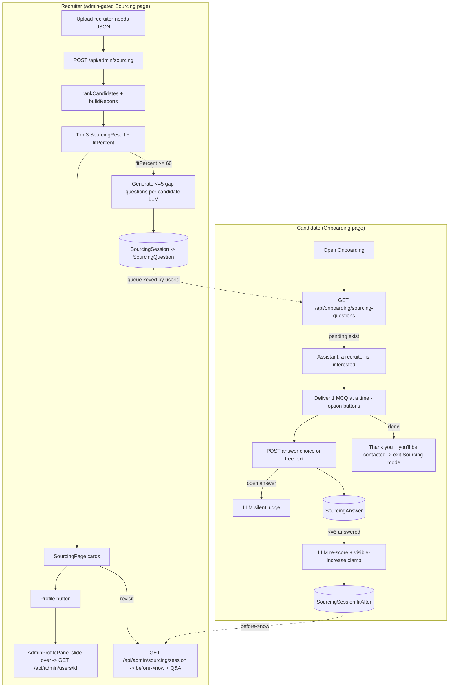

# Phase 11: Sourcing Skill-Gap Questions - Research

**Researched:** 2026-07-20
**Domain:** Next.js 15 App Router · Prisma/PostgreSQL persistence · Anthropic LLM generation & re-scoring · assistant state machine · admin/candidate boundary
**Confidence:** HIGH (all findings verified against workspace source; no external package additions required)

## Summary

Phase 11 stitches together three existing subsystems that already live in this repo: the **recruiter Sourcing** flow (`src/app/api/admin/sourcing/route.ts` + `src/components/admin/SourcingPage.tsx` + `src/lib/sourcing/*`), the **Admin profile slide-over** (`src/components/admin/AdminProfilePanel.tsx` mounted via the `admin-scrim` + `admin-panel` pattern in `AdminDashboard.tsx`), and the **candidate Onboarding assistant** (`src/components/onboarding/OnboardingCvUploadForm.tsx` + `src/app/api/onboarding/interactive/route.ts` + `src/app/api/onboarding/assistant/route.ts` + `src/types/assistant-state.ts`). No new libraries are required — every capability (LLM call pattern, JSON salvage, one-at-a-time MCQ delivery with option buttons, bounded multi-question state machine, Prisma session+children persistence) already has a house pattern to copy.

The one genuinely new thing is **persistence + a queue**: sourcing is currently stateless (results live only in `localStorage` on the recruiter's browser, `SourcingPage.tsx:8-13`). Phase 11 needs three new Prisma models (`SourcingSession` → `SourcingQuestion` → `SourcingAnswer`) mirroring the existing `InterviewSession → InterviewQuestion` shape (`prisma/schema.prisma:200-240`), plus a small generation step at the end of the sourcing run and a delivery/re-score path in onboarding.

**Primary recommendation:** Add 3 Prisma models + 1 migration; generate ≤5 gap questions per ≥60% candidate inside the sourcing `POST` after reports are built (grounded in `buildMatchChecklist` unmet/partial items, using the `report.ts` Anthropic pattern); deliver them through a **dedicated Sourcing-mode delivery endpoint** shaped like `InteractiveResponse` so the existing option-button UI renders them one at a time; re-score with a second focused LLM call that is clamped to guarantee a visible increase for good answers; read the persisted session back into the Sourcing card. Keep all recruiter-signal data server-side (candidates never see recruiter JSON or signal keys).

## Architectural Responsibility Map

| Capability | Primary Tier | Secondary Tier | Rationale |
|------------|-------------|----------------|-----------|
| Profile button → slide-over | Frontend (client `SourcingPage`) | API (`GET /api/admin/users/{id}`, already admin-gated) | Panel is a client component that self-fetches; the Sourcing page is already admin-gated so reusing it leaks nothing |
| Gap-question generation | API/Backend (sourcing `POST`) | LLM (Anthropic) | Grounded in server-only recruiter JSON + signals; must never run client-side |
| Question queue + persistence | Database (new Prisma models) | API | Cross-session state tying (recruiter run → candidate → Q&A → before/after %) |
| One-at-a-time MCQ delivery | API (new onboarding sourcing endpoint) + Frontend (existing chat UI) | Assistant state machine | Reuses `InteractiveResponse` shape + option buttons; state tracked like the mock-interview counter |
| Answer capture + silent judging | API (delivery endpoint) | LLM | Open answers judged silently server-side; correctness never returned to client |
| Match-% re-score (visible increase) | API/Backend | LLM | LLM decides delta but server clamps to guarantee a visible bump and persists before/after |
| Recruiter visibility of Q&A + before→now | Database → API → Frontend (Sourcing card) | — | Card re-reads the persisted session on each visit |

## Standard Stack

No new packages. Everything uses what is already installed.

### Core (already present)
| Library | Version | Purpose | Why Standard |
|---------|---------|---------|--------------|
| `@prisma/client` / `prisma` | `^6.11.1` [VERIFIED: package.json:21,44] | New `SourcingSession/Question/Answer` models + migration | Existing ORM; PostgreSQL datasource (`prisma/schema.prisma:5-8`) |
| `next` (App Router) | 15.x [VERIFIED: workspace] | Route handlers for generation/delivery/re-score | All existing APIs are App Router route handlers |
| `next-intl` (`useTranslations`) | installed [VERIFIED: SourcingPage.tsx:2] | EN/DE/FR message keys for notify/thank-you | Established i18n mechanism (`messages/*.json`) |
| Anthropic Messages API via `fetch` | `anthropic-version: 2023-06-01` [VERIFIED: report.ts:70-80] | Question generation, silent judging, re-score | House pattern — no SDK; raw `fetch` with `AbortController` timeout |
| `react-markdown` | installed [VERIFIED: OnboardingCvUploadForm.tsx:2] | Renders assistant chat bubbles | Already used for assistant messages |

### Supporting (reuse verbatim)
| Symbol | Location | Purpose |
|--------|----------|---------|
| `buildMatchChecklist(needs, scored, withinRadius?)` | `src/lib/sourcing/score.ts` (returns `MatchChecklistItem[]` with `status: "met"|"partial"|"unmet"`) | The gap source — unmet/partial items become questions |
| `parseSingleReport` / JSON salvage | `src/lib/sourcing/report.ts:316+` (uses `repairJsonStrings`) | Parse LLM JSON with newline/quote repair + array-unwrap |
| `callAnthropic(prompt, maxTokens)` | `src/lib/sourcing/report.ts:52` | Key hygiene, `thinking:{type:"disabled"}`, 55s abort |
| `requireAdmin()` | `src/lib/auth/admin.ts` (used in sourcing/users routes) | Admin gate returning 404 for non-admins |
| `AdminProfilePanel` | `src/components/admin/AdminProfilePanel.tsx:369` props `{userId, onClose}` | The slide-over panel to reuse |
| `InteractiveQuestion` / `InteractiveResponse` | `src/lib/onboarding/interactive.ts:7-30`, `OnboardingCvUploadForm.tsx:28-40` | MCQ shape with `options[]` + `allowCustom` |
| `updateServiceState` / `AssistantState` | `src/types/assistant-state.ts:265`, `:11` | State-machine helpers + service sub-state |

### Alternatives Considered
| Instead of | Could Use | Tradeoff |
|------------|-----------|----------|
| New `/api/onboarding/sourcing-questions` delivery endpoint | Extend `/api/onboarding/interactive` | Interactive route is tightly coupled to the 16 profile `field` names (`interactive.ts:9-27`) and `canConfirmOnboardingField`; forcing sourcing MCQs through it pollutes profile-field logic. A dedicated endpoint returning the same `InteractiveResponse` shape is cleaner and reuses the UI unchanged. **Recommend dedicated endpoint.** |
| Persist queue in new Prisma models | Reuse `OnboardingSession.pendingQuestions` JSON (`schema.prisma:170`) | The JSON blob can't express the recruiter-run → candidate → before/after relationship the recruiter card needs, and can't be queried per-run. **Recommend relational models.** |
| Second LLM call for re-score | Reuse the generation call's judgment | Re-score needs the candidate's actual answers (only available after delivery), so it is inherently a later, separate call. **Recommend separate re-score step.** |

**Installation:** none. Run `npm run prisma:migrate` (`prisma migrate dev`, package.json:15) after editing the schema.

## Package Legitimacy Audit

Not applicable — this phase installs **no external packages**. All work uses libraries already in `package.json`.

## Architecture Patterns

### System Architecture Diagram



### Recommended data model (new — `prisma/schema.prisma`)

Mirror the `InterviewSession → InterviewQuestion` shape (`schema.prisma:200-240`): a parent session with typed children, cuid ids, camelCase fields, JSON for arrays, `@@index`, `onDelete: Cascade`.

```prisma
model SourcingSession {
  id            String   @id @default(cuid())
  // The recruiter run identity. Sourcing is stateless per upload, so we mint a
  // run id here and snapshot the parsed recruiter needs for later display.
  recruiterUserId String              // the admin who ran the sourcing
  needsSnapshot   Json     @default("{}")   // RecruiterNeeds (sanitized) at run time
  roleLabel       String?                    // e.g. needs.role, for card display
  createdAt       DateTime @default(now())
  updatedAt       DateTime @updatedAt

  candidates   SourcingCandidate[]

  @@index([recruiterUserId, createdAt])
}

model SourcingCandidate {
  id          String   @id @default(cuid())
  sessionId   String
  candidateUserId String              // the candidate this question-set is for
  fitBefore   Int                     // the displayed fitPercent at generation time
  fitAfter    Int?                    // set after re-score; null until answered
  status      String   @default("pending") // pending | delivering | completed
  createdAt   DateTime @default(now())
  updatedAt   DateTime @updatedAt

  session   SourcingSession   @relation(fields: [sessionId], references: [id], onDelete: Cascade)
  questions SourcingQuestion[]

  @@index([candidateUserId, status])
  @@index([sessionId])
  // One active recruiter question-set per candidate for MVP (CONTEXT out-of-scope
  // note: multiple concurrent sets deferred). Enforce in app logic, not a DB
  // unique, so history is preserved.
}

model SourcingQuestion {
  id           String   @id @default(cuid())
  candidateId  String                 // FK to SourcingCandidate
  orderIndex   Int                    // 0..4 delivery order
  gapLabel     String                 // the checklist gap this targets (server-only context)
  prompt       String   @db.Text
  // 5 options: exactly one correct, three distractors, one "open" flag.
  // Stored as JSON [{ value, label, isCorrect, isOpen }]. isCorrect/isOpen are
  // SERVER-ONLY and MUST be stripped before sending options to the candidate.
  options      Json     @default("[]")
  allowCustom  Boolean  @default(true) // the open "write your own answer" path
  createdAt    DateTime @default(now())

  candidate SourcingCandidate @relation(fields: [candidateId], references: [id], onDelete: Cascade)
  answer    SourcingAnswer?

  @@index([candidateId, orderIndex])
  @@unique([candidateId, orderIndex])
}

model SourcingAnswer {
  id           String   @id @default(cuid())
  questionId   String   @unique
  chosenValue  String?                // option value chosen, or null for open
  freeText     String?  @db.Text      // the open answer, when allowCustom used
  // Silent judgment — NEVER returned to the candidate.
  satisfiedNeed Boolean @default(false)
  createdAt    DateTime @default(now())

  question SourcingQuestion @relation(fields: [questionId], references: [id], onDelete: Cascade)
}
```

Add back-relations to `User` if desired (optional; the models reference user ids as plain strings like `CandidateSignalState` does not — but adding relations is cleaner). Run `npm run prisma:migrate` → creates a timestamped migration under `prisma/migrations/`.

### Pattern 1: Profile button → slide-over (client-only, reuse `AdminProfilePanel`)
**What:** Add a `Profile` button per card in `SourcingPage.tsx` that sets local `profileUserId` state; render the panel + scrim exactly like `AdminDashboard.tsx:20-35`.
**Why safe:** `/admin/sourcing` is already admin-gated, and `AdminProfilePanel` self-fetches from the admin-gated `GET /api/admin/users/{userId}` (`AdminProfilePanel.tsx:379`). No candidate ever sees this page. `result.userId` is already on every `SourcingResult` (`types.ts:157`).

```tsx
// Source: AdminDashboard.tsx:14-38 (pattern) + SourcingPage.tsx card header:176-196
"use client";
import { useState } from "react";
import { AdminProfilePanel } from "@/components/admin/AdminProfilePanel";
// inside SourcingPage:
const [profileUserId, setProfileUserId] = useState<string | null>(null);
// in the card header (SourcingPage.tsx ~line 184):
<button type="button" className="sourcing-card__profile-btn"
  onClick={() => setProfileUserId(result.userId)}>
  {t("profileButton")}
</button>
// at the end of the <section>:
{profileUserId && (
  <>
    <div className="admin-scrim" role="button" tabIndex={-1}
      aria-label={t("close")} onClick={() => setProfileUserId(null)} />
    <AdminProfilePanel key={profileUserId} userId={profileUserId}
      onClose={() => setProfileUserId(null)} />
  </>
)}
```
The `admin-scrim` + `admin-panel` slide-over CSS already exists (used by `AdminDashboard`). Verify those classes are globally available (they are, since `AdminProfilePanel` renders `<aside className="admin-panel">` at `AdminProfilePanel.tsx:475`).

### Pattern 2: Grounded LLM generation (copy `report.ts` call + salvage)
**What:** After `results` are built in `sourcing/route.ts` (after line ~88), for each `result.fitPercent >= 60`, build a prompt from the candidate's **unmet/partial** `checklist` items and ask the model for ≤5 MCQs.
**Prompt shape:** one focused call per qualifying candidate (parallel via `Promise.all`, like `buildReports`), strict-JSON output, `thinking:{type:"disabled"}`, grounded ONLY in the supplied gaps. Reuse `callAnthropic` (`report.ts:52`) and a `parseSingleReport`-style salvage (`report.ts:316`).

```jsonc
// Requested JSON shape (server strips isCorrect/isOpen before delivery):
{
  "questions": [
    {
      "gapLabel": "Skill: Kubernetes",
      "prompt": "Which best describes your hands-on Kubernetes experience?",
      "options": [
        { "label": "I run production K8s clusters daily", "isCorrect": true },
        { "label": "I've only read about it", "isCorrect": false },
        { "label": "I prefer bare-metal servers", "isCorrect": false },
        { "label": "I use Docker Swarm instead", "isCorrect": false }
      ],
      "allowOpen": true
    }
  ]
}
```
Server then appends the 5th "✍️ Write your own answer" option (`isOpen:true`) and shuffles the four provided options so position isn't a tell. Model/env: `process.env.ANTHROPIC_API_KEY` + `ANTHROPIC_MODEL` (identical to `report.ts:52-61`). Cap `max_tokens` ~1500 per candidate.

### Pattern 3: Bounded one-at-a-time delivery (mirror the 3-question mock)
**What:** The mock-interview flow (`assistant/route.ts:690-800`) is the canonical bounded, one-question-per-turn state machine: it tracks `questionsAsked` in `InterviewPrepServiceState` (`assistant-state.ts:75-95`) and flips `currentMode` on/off. Sourcing mode mirrors this but the questions are **pre-generated and persisted**, so the counter is just an index into `SourcingQuestion.orderIndex`.

Recommended shape: add a `sourcing` sub-state to `AssistantState.services` (or track purely in the DB via `SourcingCandidate.status` + count of answered questions — **preferred**, since questions already persist and survive context resets):
- **Trigger:** on Onboarding load, `GET /api/onboarding/sourcing-questions` checks for a `SourcingCandidate` with `status != completed` for `session.user.id`. If found → Sourcing mode takes priority over normal profile/services flow.
- **Notify first:** the first response includes the "🎉 Great news — a recruiter is interested in you!" notice, THEN question 1.
- **Deliver:** return one `InteractiveResponse`-shaped question at a time (question + 5 options + `allowCustom:true`), stripping `isCorrect`/`isOpen`.
- **Capture:** `POST` the answer → write `SourcingAnswer`; if free-text → silent LLM judge sets `satisfiedNeed`; advance `orderIndex`.
- **Never reveal correctness:** the POST response contains only the next question or the done state — no correctness field.
- **Finish (≤5):** after the last answer, run the re-score (Pattern 4), set `SourcingCandidate.status="completed"`, return the cheerful thank-you + "if the recruiter chooses you, you'll be contacted", and exit Sourcing mode (the UI falls back to the normal assistant).

### Pattern 4: Re-score with guaranteed visible increase (LLM + server clamp)
**What:** After all answers are captured, one focused LLM call receives: `fitBefore`, the recruiter gaps, and the candidate's answers (choice correctness + `satisfiedNeed` for open ones), and returns a new `fitPercent`. Decision D3 says the delta is LLM-driven but a satisfactory answer must produce a **visible** increase.
**Server guarantee:** clamp the LLM's returned value:
```ts
// good = count of correct choices + satisfiedNeed open answers
const llmAfter = clampInt(parsed.fitAfter, 0, 100);
const minVisible = good > 0 ? Math.min(100, fitBefore + Math.max(1, good)) : fitBefore;
const fitAfter = Math.max(llmAfter, minVisible); // never below a visible bump for good answers
```
Persist `SourcingCandidate.fitAfter = fitAfter`. This reconciles with the recruiter's displayed number: the Sourcing route currently shows `report.fitPercent` (`sourcing/route.ts:82`), and the card shows `fitBefore -> fitAfter` from the persisted session (Pattern 5).

### Pattern 5: Recruiter visibility (read persisted session back)
**What:** Add `GET /api/admin/sourcing/session?...` (admin-gated) returning, per candidate, `{ fitBefore, fitAfter, questions: [{prompt, chosenLabel|freeText}] }`. The Sourcing card renders a new section: the Q&A list and a `fitBefore -> fitAfter` badge. Because data is in Postgres (not `localStorage`), it survives reloads and is visible whenever the recruiter revisits.
**Reconcile with existing persistence:** `SourcingPage` currently restores results from `localStorage` (`SourcingPage.tsx:29-45`). Keep that for the base ranking, but fetch the persisted Q&A/before-after by `userId` on mount so answered candidates show updated numbers even in a fresh browser.

### Recommended file layout (new)
```
prisma/schema.prisma                          # + SourcingSession/Candidate/Question/Answer
src/lib/sourcing/questions.ts                 # generateGapQuestions(needs, result) -> LLM
src/lib/sourcing/rescore.ts                   # rescoreFromAnswers(...) -> clamped fitAfter
src/lib/sourcing/session-dal.ts               # create run, queue questions, read-back
src/app/api/onboarding/sourcing-questions/route.ts   # GET next / POST answer (candidate)
src/app/api/admin/sourcing/session/route.ts   # GET persisted Q&A + before->now (recruiter)
# edits:
src/app/api/admin/sourcing/route.ts           # generate+persist after results built
src/components/admin/SourcingPage.tsx         # Profile button + slide-over + Q&A section
src/components/onboarding/OnboardingCvUploadForm.tsx  # check pending sourcing on load
```

### Anti-Patterns to Avoid
- **Sending `isCorrect`/`isOpen` to the candidate.** Strip these server-side in the delivery endpoint. The candidate must never learn correctness (behavioral rule).
- **Rendering recruiter JSON / signal keys on the candidate page.** The gap label (`Skill: Kubernetes`) is safe phrasing; never surface `needsSnapshot`, signal keys, or the recruiter's identity.
- **Forcing sourcing MCQs through `/api/onboarding/interactive`.** That route validates against the 16 profile field names (`interactive.ts:9-27`); a dedicated endpoint keeps concerns separate.
- **Client-side re-score.** All LLM calls and correctness logic stay in route handlers (server), like every existing Anthropic call.
- **A DB-unique on active candidate question-sets.** Keep history; enforce "one active set" in app logic (MVP scope note).

## Don't Hand-Roll

| Problem | Don't Build | Use Instead | Why |
|---------|-------------|-------------|-----|
| LLM JSON parsing | A bespoke parser | `parseSingleReport` + `repairJsonStrings` (`report.ts:316`) | Handles the exact failure modes (literal newlines, unescaped quotes, array-wrap) already seen in prod |
| Anthropic call plumbing | New fetch wrapper | `callAnthropic` (`report.ts:52`) | Key hygiene, timeout, thinking-disabled all solved |
| Gap identification | Re-derive met/unmet | `buildMatchChecklist` (`score.ts`) | Already computes met/partial/unmet per requirement |
| One-at-a-time MCQ UI | New chat component | Existing option-button render (`OnboardingCvUploadForm.tsx:740-760`) | Buttons already wired to `submitAnswerValue`; reuse `InteractiveResponse` shape |
| Slide-over panel | New modal | `AdminProfilePanel` + `admin-scrim` (`AdminDashboard.tsx:20-35`) | Exact view + CSS already exist |
| Bounded question counter | Ad-hoc flags | Mirror mock-interview `questionsAsked` (`assistant/route.ts:698-800`) or DB `orderIndex` | Proven bounded flow |

**Key insight:** Phase 11 is 80% integration of proven patterns + 20% new persistence. The risk is not novel algorithms; it's the admin/candidate data boundary and state-machine interaction with Phase 10 modes.

## Runtime State Inventory

This is an additive feature phase (new models + endpoints), not a rename/refactor. The only "state" concerns are:

| Category | Items Found | Action Required |
|----------|-------------|------------------|
| Stored data | New Postgres tables (`SourcingSession/Candidate/Question/Answer`). Existing `localStorage` key `jobscout24.sourcing-results.v1` (`SourcingPage.tsx:11`) holds base ranking only. | New migration; keep localStorage for base results, add DB read for Q&A/before-after |
| Live service config | None | None |
| OS-registered state | None | None |
| Secrets/env vars | Reuses `ANTHROPIC_API_KEY`, `ANTHROPIC_MODEL` (already configured, `report.ts:52-61`) | None new |
| Build artifacts | Prisma client regenerated by migration (`npm run prisma:generate`) | Run migrate/generate after schema edit |

## Common Pitfalls

### Pitfall 1: The ≥60% trigger uses the wrong number
**What goes wrong:** Generating questions from the deterministic `scored.score` instead of the **displayed** `report.fitPercent`.
**Why it happens:** The route has both — `scored.score` (deterministic) and `report.fitPercent` (LLM, what the recruiter sees), and re-sorts by the latter (`sourcing/route.ts:100-104`).
**How to avoid:** Gate generation on `result.fitPercent >= 60` (the value on the final `SourcingResult`), and store it as `fitBefore`. Warning sign: candidates shown at 58% getting questions, or 62% candidates skipped.

### Pitfall 2: Position/order of the correct option is a tell
**What goes wrong:** The correct option is always first (as the LLM tends to emit it).
**How to avoid:** Shuffle the 4 provided options server-side before persisting; append the open option last. Persist the final option array so delivery order is stable across the candidate's session.

### Pitfall 3: Sourcing mode collides with Phase 10 interview/target-role modes
**What goes wrong:** The onboarding assistant already has a global target-role detector on every message (`assistant/route.ts:~228`) and a lingering `practice` mode that "hijacks" messages (`assistant/route.ts:~500-520`). A naive sourcing mode could fight these.
**How to avoid:** Deliver sourcing questions through the **dedicated** endpoint + option buttons (not free-text through `/assistant`), so they don't pass through the target-role/interview routing at all. Only enter Sourcing mode when `GET /api/onboarding/sourcing-questions` reports pending items, and give it priority in `OnboardingCvUploadForm`'s load sequence (before/instead of `loadInteractiveQuestion`, `OnboardingCvUploadForm.tsx:283`).

### Pitfall 4: LLM re-score returns a decrease or no visible change
**What goes wrong:** D3 requires a visible increase for good answers; the LLM may return an equal or lower number.
**How to avoid:** Server clamp (Pattern 4): `fitAfter = max(llmAfter, fitBefore + max(1, goodAnswers))`, capped at 100. Warning sign: recruiter card shows `72 -> 72` after strong answers.

### Pitfall 5: Migration drift / unsafe deploy
**What goes wrong:** Editing the schema without a migration, or a migration that breaks existing rows.
**How to avoid:** All new models are additive (no column changes to existing tables), so the migration is safe. Use `npm run prisma:migrate` (dev) to generate the file under `prisma/migrations/`; the additive nature means no backfill needed.

### Pitfall 6: LLM latency/cost on large candidate pools
**What goes wrong:** Generation adds up to 3 extra LLM calls per run (one per ≥60% candidate) on top of the 3 report calls.
**How to avoid:** Only the top-3 shown candidates are ever considered (`RESULT_COUNT=3`, `sourcing/route.ts:13`), and only those ≥60%. Run them in parallel (`Promise.all`) like `buildReports`. Cap `max_tokens`. Generation must not block the recruiter response longer than necessary — consider generating after the response is prepared but before returning (acceptable for MVP) or accept the added latency since it's ≤3 parallel calls.

## Code Examples

### Reusing the Anthropic call + salvage for generation
```ts
// Source: src/lib/sourcing/report.ts:52 (callAnthropic) + :316 (parseSingleReport)
import { /* copy */ } from "./report"; // or factor callAnthropic into a shared util
const gaps = result.checklist.filter((c) => c.status !== "met").map((c) => c.label);
const prompt = buildGapQuestionsPrompt(needs, result, gaps); // strict-JSON, grounded
const raw = await callAnthropic(prompt, 1500);
const parsed = raw ? parseQuestionsJson(raw) : null; // mirror parseSingleReport salvage
```

### Stripping server-only fields before delivery
```ts
// delivery endpoint — candidate NEVER sees isCorrect/isOpen
const publicOptions = question.options.map((o: any) => ({
  value: o.value ?? o.label,
  label: o.label,
  description: o.description
}));
return NextResponse.json({
  question: { id: question.id, prompt: question.prompt, options: publicOptions, allowCustom: question.allowCustom },
  notice: firstQuestion ? t("sourcing.recruiterInterested") : undefined,
  done: false
});
```

## State of the Art

| Old Approach | Current Approach | Impact |
|--------------|------------------|--------|
| Sourcing results only in browser `localStorage` (`SourcingPage.tsx:8-13`) | Persisted `SourcingSession` in Postgres | Recruiter sees Q&A + before→now on any device/visit |
| Assistant delivers only profile fields or free chat | Adds a prioritized, bounded Sourcing MCQ mode | Recruiter-driven gap-closing on the candidate side |

**Deprecated/outdated:** none removed. Base ranking `localStorage` stays for the recruiter's convenience.

## Assumptions Log

| # | Claim | Section | Risk if Wrong |
|---|-------|---------|---------------|
| A1 | The `admin-scrim` / `admin-panel` slide-over CSS classes are globally scoped and render correctly on the Sourcing page (they're defined for `AdminDashboard`). | Pattern 1 | Minor — if scoped, copy the CSS; verify during planning by checking the global stylesheet. |
| A2 | Tracking Sourcing-mode progress purely via DB (`SourcingCandidate.status` + answered count) is preferable to adding a `sourcing` sub-state in `AssistantState`. Either works. | Pattern 3 | Low — both are viable; DB is more resilient to context resets. |
| A3 | Generating questions synchronously inside the sourcing `POST` (≤3 parallel calls) is acceptable latency for MVP. | Pitfall 6 | Medium — if runs feel slow, move generation to a deferred step; confirm acceptable in planning. |
| A4 | The re-score visible-increase clamp (`+max(1, goodAnswers)`) satisfies D3's "visible increase" intent. | Pattern 4 | Low — exact bump size is a product choice; confirm the minimum visible delta with the user. |
| A5 | One active recruiter question-set per candidate (no DB unique, app-enforced) matches the MVP scope note. | Data model | Low — CONTEXT explicitly defers multiple concurrent sets. |

## Open Questions

1. **Where exactly to run generation** — inside `sourcing/route.ts` before returning, vs. a follow-up call.
   - Known: only top-3 ≥60% candidates qualify; ≤3 parallel LLM calls.
   - Recommendation: generate before returning for MVP simplicity; measure latency.
2. **Minimum visible increase size** — +1 per good answer, or a larger LLM-chosen bump floored at +1?
   - Recommendation: floor at `+max(1, goodAnswers)`, let LLM go higher. Confirm with user.
3. **Does the candidate see a running % during the flow?** CONTEXT says the recruiter sees before→now; candidate is told "you'll be contacted." Assume candidate does NOT see numbers.

## Environment Availability

| Dependency | Required By | Available | Version | Fallback |
|------------|------------|-----------|---------|----------|
| PostgreSQL (`DATABASE_URL`) | New Prisma models | ✓ (datasource configured) | — | none (blocking) |
| Anthropic API (`ANTHROPIC_API_KEY`+`ANTHROPIC_MODEL`) | Generation, silent judge, re-score | ✓ (already used by sourcing/CV) | — | Deterministic fallback: if key absent, skip generation (no questions queued) — feature degrades gracefully like `report.ts` fallback |
| Prisma CLI | Migration | ✓ | `^6.11.1` | none |

**Missing dependencies with no fallback:** none. **With fallback:** Anthropic — absence simply means no questions generated (recruiter still sees base ranking), matching the existing `usedLlm=false` degradation.

## Validation Architecture

### Test Framework
| Property | Value |
|----------|-------|
| Framework | Vitest `^2.0.5` [VERIFIED: package.json:46] |
| Config file | `vitest.config.ts` [VERIFIED: workspace root] |
| Quick run command | `npx vitest run <file> -t "<name>"` |
| Full suite command | `npm run test` (`vitest run`) |
| E2E | Playwright `^1.53.2` (`npm run test:e2e`) |

### Phase Requirements → Test Map
| Behavior | Test Type | Automated Command | File Exists? |
|----------|-----------|-------------------|--------------|
| Gap extraction from checklist (unmet/partial only) | unit | `npx vitest run src/lib/sourcing/questions.test.ts` | ❌ Wave 0 |
| Question JSON parse/salvage + strip `isCorrect`/`isOpen` | unit | `npx vitest run src/lib/sourcing/questions.test.ts` | ❌ Wave 0 |
| Re-score clamp guarantees visible increase for good answers | unit | `npx vitest run src/lib/sourcing/rescore.test.ts` | ❌ Wave 0 |
| ≥60% trigger uses displayed `fitPercent` | unit | `npx vitest run src/lib/sourcing/questions.test.ts` | ❌ Wave 0 |
| Delivery endpoint never returns correctness | integration | route handler test w/ mocked db | ❌ Wave 0 |
| Recruiter read-back returns before→now + Q&A | integration | route handler test | ❌ Wave 0 |
| Candidate cannot reach admin sourcing/session endpoints | integration (authz) | `requireAdmin` 404 assertion | ❌ Wave 0 |

### Sampling Rate
- **Per task commit:** `npx vitest run <touched test file>`
- **Per wave merge:** `npm run test`
- **Phase gate:** `npm run test` green + `npm run build` 0 errors before `/gsd-verify-work`.

### Wave 0 Gaps
- [ ] `src/lib/sourcing/questions.test.ts` — gap extraction, salvage, option stripping, ≥60 trigger
- [ ] `src/lib/sourcing/rescore.test.ts` — visible-increase clamp
- [ ] Route handler tests for the two new endpoints (mock Prisma + `requireAdmin`)
- [ ] No new framework install needed (Vitest already configured)

## Security Domain

`security_enforcement: true`, `security_asvs_level: 1` (`.planning/config.json`).

### Applicable ASVS Categories
| ASVS Category | Applies | Standard Control |
|---------------|---------|-----------------|
| V1/V4 Access Control | yes | `requireAdmin()` on ALL recruiter endpoints (`admin.ts`); candidate delivery endpoint gated to `session.user.id` owning the `SourcingCandidate` |
| V5 Input Validation | yes | Reuse `parseRecruiterNeeds` sanitizer (`recruiter-needs.ts`); clamp/validate answer payloads; bound free-text length (`@db.Text` but validate max in route) |
| V6 Cryptography | no | No new secrets; reuse existing API key hygiene (`report.ts:52-58`) |
| Data segregation | yes | Strip `isCorrect`/`isOpen`, `needsSnapshot`, signal keys, recruiter identity from every candidate-facing response |

### Known Threat Patterns
| Pattern | STRIDE | Standard Mitigation |
|---------|--------|---------------------|
| Candidate enumerates/answers another user's question-set | Elevation/Tampering | Scope every candidate query to `session.user.id`; verify `SourcingCandidate.candidateUserId === session.user.id` before serving/accepting answers |
| Correctness leakage (candidate learns right answer) | Information Disclosure | Never include `isCorrect`/`satisfiedNeed`/re-score in candidate responses |
| Recruiter JSON / signal leakage to candidate | Information Disclosure | `needsSnapshot` and signal keys stay server-side; questions phrased generically |
| Prompt injection via recruiter JSON or free-text answer | Tampering | Recruiter JSON already sanitized (`recruiter-needs.ts`); treat free-text answers as untrusted, clamp length, and the silent-judge prompt must ground only in whether the answer meets the need |
| Non-admin reaching recruiter read-back | Elevation | `requireAdmin()` 404 first, before any DB read (`sourcing/route.ts:24-27` pattern) |

## Sources

### Primary (HIGH confidence) — workspace source, verified this session
- `src/app/api/admin/sourcing/route.ts` — stateless run, `fitPercent` display, `RESULT_COUNT=3`
- `src/components/admin/SourcingPage.tsx` — card structure, `result.userId`, localStorage persistence
- `src/components/admin/AdminProfilePanel.tsx` / `AdminDashboard.tsx` — slide-over reuse + props
- `src/lib/sourcing/{types,score,report,recruiter-needs,aggregate}.ts` — checklist gaps, LLM pattern, salvage
- `src/lib/onboarding/interactive.ts` + `src/app/api/onboarding/interactive/route.ts` — MCQ shape + option flow
- `src/app/api/onboarding/assistant/route.ts` — phase routing + bounded 3-question mock pattern
- `src/types/assistant-state.ts` — state machine + service sub-state helpers
- `src/components/onboarding/OnboardingCvUploadForm.tsx` — chat UI, option buttons, load sequence, dual endpoints
- `prisma/schema.prisma` — model conventions + `InterviewSession→InterviewQuestion` template
- `src/lib/auth/admin.ts` — `requireAdmin` gate
- `.planning/config.json` / `package.json` — validation + security toggles, scripts

### Secondary / Tertiary
- None required — no external lookups; feature is fully internal to the codebase.

## Metadata

**Confidence breakdown:**
- Standard stack: HIGH — no new deps; every pattern verified in-repo.
- Architecture/data model: HIGH — mirrors existing `InterviewSession` relational shape.
- State-machine integration: MEDIUM/HIGH — mock-interview flow is a direct template; Phase 10 interaction needs care (Pitfall 3).
- Re-score visible-increase: MEDIUM — clamp approach is sound but exact delta is a product decision (A4).

**Research date:** 2026-07-20
**Valid until:** stable (internal codebase) — re-verify only if the sourcing route, assistant state machine, or Prisma schema change.
