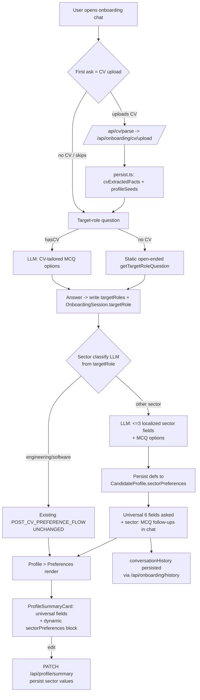

# Phase 12: Dynamic Sector-Aware Onboarding Flow - Research

**Researched:** 2026-07-20
**Domain:** Next.js 15 App Router onboarding engine + Prisma/PostgreSQL + Anthropic LLM (structured, localized field generation)
**Confidence:** HIGH (all findings verified by reading the actual repo files; no external package research required — everything reuses in-repo patterns)

<user_constraints>
## User Constraints (from CONTEXT.md)

### Locked Decisions
- **D-01:** LLM classifies the job sector **open-endedly** from the target role (any sector) and generates the most relevant fields for that sector. Not a curated list.
- **D-02:** LLM is treated as **always available** — no elaborate offline fallback path (graceful degradation only; if generation returns null, fall through to universal-only, do not block onboarding).
- **D-03:** Sector-specific field **definitions + values persist per-user across sessions**, surfaced in Profile > Preferences. Store on the candidate profile as structured data — recommended additive `sectorPreferences` JSON field on `CandidateProfile` holding `{ sector, fields: [{ key, label, value, options }] }`. Engineer/default columns stay untouched (additive migration only).
- **D-04:** Maximum **3** sector-specific fields shown/stored per user.
- **D-05:** Sector-specific fields are collected **both** in the onboarding chat **and** rendered dynamically on the Profile > Preferences page (read from the persisted store), alongside universal fields.
- **D-06:** Always-present universal set: **Current situation, Work rate, Contract type, Work permit, Salary expectation, Preferred location.** Rendered on top of sector-specific fields for every sector.
- **D-07:** The ≤3 sector fields **ARE** the follow-up questions — each is asked as **one multiple-choice question** with a type-your-own option. No separate extra question set.
- **D-08:** Dynamically generated field **labels, questions, and options are localized to the user's active locale (EN/DE/FR)**.
- **D-09:** All new copy stays in the cheerful, emoji-rich personality from `prompts/prompt.txt` (reduced-emoji applies ONLY to mock-interview mode, out of scope here).

### the agent's Discretion
- Exact JSON shape of the sector-field store, the LLM prompt design for sector/field generation, MCQ option counts, and how the dynamic Preferences renderer is wired — left to research/planning, as long as the decisions above hold.

### Deferred Ideas (OUT OF SCOPE)
- None — discussion stayed within phase scope.
- Out of phase boundary: changing scoring/matching, sourcing, non-onboarding surfaces; brand-new profile capabilities beyond sector-aware preference fields.
</user_constraints>

<phase_requirements>
## Phase Requirements

Phase 12 in `.planning/ROADMAP.md` lists `Requirements: TBD`. The binding requirements ARE the locked decisions D-01..D-09 above plus the 6-step flow in `12-CONTEXT.md`. The flow must NOT regress the prior onboarding requirement families the roadmap ties to earlier phases:

| Family | Origin | Research Support (must not regress) |
|--------|--------|-------------------------------------|
| CVIN-01..05 | Phase 2 (CV-aware onboarding) | CV upload/extraction path in [src/app/api/onboarding/cv/upload/route.ts](src/app/api/onboarding/cv/upload/route.ts) + [src/lib/onboarding/persist.ts](src/lib/onboarding/persist.ts) stays intact; sector generation reads `cvExtractedFacts`, never rewrites it. |
| AION-01..09 | Phase 2 | Interactive question engine [src/lib/onboarding/interactive.ts](src/lib/onboarding/interactive.ts) + [src/app/api/onboarding/interactive/route.ts](src/app/api/onboarding/interactive/route.ts) extended additively. |
| Phase 5 cheerful preference questions | Phase 5 | Existing `POST_CV_PREFERENCE_FLOW` copy/tone preserved; new copy matches. |
| Phase 10 dynamic target-role binding | Phase 10 | Dual-write `targetRoles` + `OnboardingSession.targetRole` in [src/app/api/onboarding/assistant/route.ts](src/app/api/onboarding/assistant/route.ts) STEP 2 must keep working; sector trigger hangs off the SAME "target role set" event. |
| Phase 11 sourcing delivery | Phase 11 | Sourcing MCQ mode (`sourcing:` field prefix) in the chat UI must not collide — sector mode uses a DISTINCT `sector:` prefix. |
</phase_requirements>

## Summary

Everything this phase needs already exists as a reusable in-repo pattern — this is an **integration + additive-schema** phase, not a new-stack phase. The onboarding chat is a structured question engine: [src/lib/onboarding/interactive.ts](src/lib/onboarding/interactive.ts) defines an ordered array of `InteractiveQuestion` objects (each with `field`, `prompt`, `options`, `allowCustom`), and [getInteractiveQuestionStateForMode](src/lib/onboarding/interactive.ts) returns the next unanswered one. The chat UI [src/components/onboarding/OnboardingCvUploadForm.tsx](src/components/onboarding/OnboardingCvUploadForm.tsx) already renders MCQ buttons **plus** a free-text "type-your-own" box, and Phase 11's **Sourcing mode** (field prefix `sourcing:`, endpoint [src/app/api/onboarding/sourcing-questions/route.ts](src/app/api/onboarding/sourcing-questions/route.ts)) is a working precedent for delivering **LLM-generated MCQ questions one-at-a-time in-chat** with resume/persistence. The sector follow-ups should be modeled almost exactly on Sourcing mode, using a distinct `sector:` prefix.

The house Anthropic call ([callAnthropic](src/lib/sourcing/anthropic.ts) + [parseLlmJson](src/lib/sourcing/anthropic.ts)) and the sourcing question generator ([buildPrompt](src/lib/sourcing/questions.ts) + [normalizeQuestion](src/lib/sourcing/questions.ts)) give a ready template for a **localized sector-classification + ≤3-field generation** call. Target-role writing already happens in two places (assistant route dual-write; interactive route `primaryRole`→`targetRoles` mirror), so the "target role set" trigger point is well-defined. Storage is a single additive Prisma JSON column (`sectorPreferences`) on `CandidateProfile` — no touching existing preference columns.

**Primary recommendation:** Add one additive Prisma JSON column (`sectorPreferences`), one LLM lib (`src/lib/onboarding/sector-fields.ts`) reusing `callAnthropic`/`parseLlmJson`, one CV-tailored target-role question generator (extend `detect-target-role.ts`), a `sector:`-prefixed question mode wired into the interactive/resume endpoints (cloned from Sourcing mode), and a dynamic Preferences block in `ProfileSummaryCard`. Engineer/software sector short-circuits to the existing flow unchanged.

## Architectural Responsibility Map

| Capability | Primary Tier | Secondary Tier | Rationale |
|------------|-------------|----------------|-----------|
| Sector classification + ≤3 field generation | API / Backend | — | Anthropic key is server-only ([callAnthropic](src/lib/sourcing/anthropic.ts) reads `process.env.ANTHROPIC_API_KEY`); never expose to browser. |
| CV-tailored target-role MCQ generation | API / Backend | — | Needs `cvExtractedFacts` + LLM; server-only. |
| Persisting sector fields (defs + values) | Database / Storage | API | New `CandidateProfile.sectorPreferences` JSON; written by API routes. |
| Delivering sector MCQ follow-ups in chat | API / Backend | Browser/Client | Question state computed server-side; UI just renders `options` + free-text (existing pattern). |
| Rendering universal + sector fields on Preferences | Frontend Server (SSR) | Browser/Client | [profile/summary/page.tsx](src/app/(app)/profile/summary/page.tsx) is `force-dynamic` SSR; [ProfileSummaryCard](src/components/profile/ProfileSummaryCard.tsx) is the client editor. |
| Resume/persistence across sessions | Database / Storage | API | `OnboardingSession.conversationHistory` + `CandidateProfile.sectorPreferences`. |
| Localization of dynamic copy | API / Backend | — | Copy generated in the active locale at LLM-generation time (D-08), NOT via static next-intl keys. |

## Standard Stack

No new external packages. Everything reuses in-repo modules.

### Core (existing, reuse verbatim)
| Module | Location | Purpose | Why Standard |
|--------|----------|---------|--------------|
| `callAnthropic(prompt, maxTokens)` | [src/lib/sourcing/anthropic.ts](src/lib/sourcing/anthropic.ts) | House Anthropic Messages fetch (x-api-key, `anthropic-version: 2023-06-01`, AbortController 55s, `thinking:{type:"disabled"}`, null-on-failure) | Already the blessed server-only LLM call; matches D-02 graceful degradation. |
| `parseLlmJson<T>(raw)` | [src/lib/sourcing/anthropic.ts](src/lib/sourcing/anthropic.ts) | Fence-tolerant JSON salvage (strips ```json fences, repairs CR/LF/quotes, unwraps single-element arrays) | Handles the two failure modes Claude produces most; returns null not throw. |
| `getInteractiveQuestionStateForMode(profile, {hasCvUpload})` | [src/lib/onboarding/interactive.ts](src/lib/onboarding/interactive.ts) | Next-question resolver over an ordered `InteractiveQuestion[]` | The engine the whole chat flow runs on. |
| Sourcing-mode delivery | [src/app/api/onboarding/sourcing-questions/route.ts](src/app/api/onboarding/sourcing-questions/route.ts) | Working precedent: LLM MCQ, one-at-a-time, in-chat, resume, `allowCustom` | Clone its shape for `sector:` questions. |
| `detectTargetRoleIntent` | [src/lib/onboarding/detect-target-role-llm.ts](src/lib/onboarding/detect-target-role-llm.ts) | LLM first-person target-role detector (normalize + cap 60 chars) | The "target role set" event source. |
| `getTargetRoleQuestion` / `getTargetRoleAck` | [src/lib/onboarding/detect-target-role.ts](src/lib/onboarding/detect-target-role.ts) | Localized static open-ended role question + ack | Extend for CV-tailored MCQ branch. |

### Supporting (existing)
| Module | Location | Purpose |
|--------|----------|---------|
| `canConfirmOnboardingField(field)` | [src/lib/onboarding/confirm-policy.ts](src/lib/onboarding/confirm-policy.ts) | Allowlist gate on POST answers — **must be widened** to accept `sector:*` (or given a `startsWith("sector:")` branch). |
| `upsertOnboardingCvExtraction` | [src/lib/onboarding/persist.ts](src/lib/onboarding/persist.ts) | Saves `cvExtractedFacts`, `profileSeeds`, sets `currentStep:"questioning"`. |
| `restoreOnboardingState` | [src/app/api/onboarding/resume/route.ts](src/app/api/onboarding/resume/route.ts) | Rehydrates chat on refresh; extend to surface pending sector questions. |
| next-intl `useTranslations` + `messages/{en,de,fr}.json` | [messages/en.json](messages/en.json) | Static UI chrome only — NOT for dynamic sector copy. |
| `SUPPORTED_LOCALES` / `isSupportedLocale` | [src/i18n/config.ts](src/i18n/config.ts) | `["en","de","fr"]` locale guard. |

### Alternatives Considered
| Instead of | Could Use | Tradeoff |
|------------|-----------|----------|
| Additive `sectorPreferences` JSON column | New relational `SectorField` table | Rejected — D-03 mandates additive JSON on the profile; a table is heavier and off-spec. |
| Cloning Sourcing mode for `sector:` questions | Extending `POST_CV_PREFERENCE_FLOW` array directly | The static array `field` is a **closed union of profile column names**; sector fields map to a JSON store, not columns — a `sector:`-prefixed dynamic mode (like sourcing) is the correct fit. |
| Generating copy in-locale at LLM time (D-08) | Static next-intl keys | Impossible — sector/fields are open-ended (D-01); keys can't pre-exist. Must generate localized. |

**Installation:** None — no new dependencies.

## Package Legitimacy Audit

Not applicable — this phase installs **no external packages**. All work reuses existing in-repo modules and the already-configured `@anthropic` HTTP pattern (raw `fetch`, no SDK). No `npm install` required.

## Architecture Patterns

### System Architecture Diagram



### Recommended Project Structure (new/changed files)
```
src/lib/onboarding/
├── sector-fields.ts          # NEW: classifySectorAndGenerateFields() -> SectorFieldSet | null (LLM)
├── detect-target-role.ts     # EDIT: add generateTargetRoleQuestion({locale, cvFacts})
├── interactive.ts            # EDIT: universal-6 subset + engineer short-circuit helper
└── confirm-policy.ts         # EDIT: allow "sector:" prefixed fields

src/app/api/onboarding/
├── sector-questions/route.ts # NEW: deliver sector MCQ one-at-a-time (clone sourcing-questions)
├── interactive/route.ts      # EDIT: branch universal vs engineer; trigger sector generation
└── resume/route.ts           # EDIT: surface pending sector question + include sectorPreferences

src/components/onboarding/
└── OnboardingCvUploadForm.tsx # EDIT: sector-mode wiring (clone checkSourcingQuestions)

src/components/profile/
└── ProfileSummaryCard.tsx    # EDIT: dynamic sectorPreferences block under Preferences

src/app/api/profile/summary/route.ts # EDIT: accept + persist sectorPreferences values

prisma/schema.prisma          # EDIT: add sectorPreferences Json @default("{}") to CandidateProfile
```

### Pattern 1: Localized structured LLM generation (reuse `callAnthropic` + `parseLlmJson`)
**What:** Server-only Anthropic call returning strict JSON, salvaged and null-safe.
**When to use:** Both the sector-field generator AND the CV-tailored target-role MCQ generator.
**Example:**
```typescript
// Source: mirrors src/lib/sourcing/questions.ts::generateQuestions
import { callAnthropic, parseLlmJson } from "@/lib/sourcing/anthropic";

type SectorFieldSet = {
  sector: string;
  fields: Array<{
    key: string;              // slug, e.g. "teaching_level"
    label: string;            // localized, e.g. "Niveau d'enseignement"
    question: string;         // localized cheerful MCQ prompt (D-09)
    options: Array<{ value: string; label: string }>; // localized
  }>;
};

export async function classifySectorAndGenerateFields(args: {
  targetRole: string;
  locale: "en" | "de" | "fr";
  cvContext?: string;
}): Promise<SectorFieldSet | null> {
  const prompt = buildSectorPrompt(args); // strict-JSON, "respond in <locale>", cheerful tone
  const raw = await callAnthropic(prompt, 900);
  if (!raw) return null; // D-02 graceful degradation
  const parsed = parseLlmJson<SectorFieldSet>(raw);
  if (!parsed) return null;
  return normalizeSectorFields(parsed); // cap 3 fields, cap ~5 options, slug keys, strip control chars
}
```

### Pattern 2: `sector:`-prefixed dynamic question mode (clone Sourcing mode)
**What:** Deliver each generated sector field as one MCQ in chat, one at a time, with `allowCustom: true`.
**When to use:** The ≤3 sector follow-ups (D-07).
**Example (server payload shape the UI already understands):**
```typescript
// Source: shape from src/app/api/onboarding/sourcing-questions/route.ts (InteractiveResponse-compatible)
return NextResponse.json({
  question: {
    id: `sector:${field.key}`,
    field: `sector:${field.key}`,   // DISTINCT prefix (sourcing uses "sourcing:")
    prompt: field.question,          // localized + cheerful
    options: field.options,          // [{ value, label }]
    allowCustom: true                // type-your-own (D-07)
  },
  done: false
});
```
The chat UI already renders `question.options` as buttons and a free-text box, and `submitAnswerValue(value, "option" | "freeText")` handles both — see [OnboardingCvUploadForm.tsx](src/components/onboarding/OnboardingCvUploadForm.tsx). On answer, write the value into `sectorPreferences.fields[key].value` (JSON), not a profile column.

### Pattern 3: CV-tailored vs open-ended target-role branch
**What:** With a CV, generate MCQ options tailored to CV facts; without, use the existing static open-ended question.
**Example:**
```typescript
// Source: extend src/lib/onboarding/detect-target-role.ts
export async function generateTargetRoleQuestion(args: {
  locale: "en" | "de" | "fr";
  cvFacts?: Record<string, unknown> | null;   // from OnboardingSession.cvExtractedFacts
}): Promise<{ prompt: string; options?: Array<{ value: string; label: string }>; allowCustom: true }> {
  if (!args.cvFacts || Object.keys(args.cvFacts).length === 0) {
    return { prompt: getTargetRoleQuestion(args.locale), allowCustom: true }; // open-ended
  }
  const set = await classifyRoleOptionsFromCv(args); // LLM: e.g. "math teacher" CV -> High school teacher / University lecturer / ...
  return set
    ? { prompt: set.prompt, options: set.options, allowCustom: true }
    : { prompt: getTargetRoleQuestion(args.locale), allowCustom: true }; // null-safe fallback
}
```
Deliver with `field: "targetRoles"` so the existing POST path saves it; **also** mirror to `OnboardingSession.targetRole` (see Pattern 4).

### Pattern 4: Target-role dual-write (already established — reuse, don't duplicate)
Two existing write sites define the "target role set" event:
- [assistant/route.ts](src/app/api/onboarding/assistant/route.ts) STEP 2: `detectTargetRoleIntent` → `db.onboardingSession.update({ targetRole })` **and** `db.candidateProfile.update({ targetRoles })`, then `getTargetRoleAck`.
- [interactive/route.ts](src/app/api/onboarding/interactive/route.ts) POST: when `field === "primaryRole"` and `targetRoles` empty, mirrors `value` into `targetRoles`.

**The sector trigger must fire when `targetRoles` is set in BOTH `CandidateProfile.targetRoles` AND `OnboardingSession.targetRole` (D-03/Step 3).** Recommended: after the target-role answer POST completes, check both are populated → call `classifySectorAndGenerateFields` once → persist defs to `sectorPreferences` (idempotent: skip if `sectorPreferences.sector` already set for the same targetRole+locale).

### Anti-Patterns to Avoid
- **Widening the `InteractiveQuestion.field` union** to hold arbitrary sector keys — it's a typed union of profile columns and feeds `canConfirmOnboardingField`. Use the separate `sector:`-prefixed dynamic mode instead.
- **Static next-intl keys for sector labels/options** — violates D-01/D-08; sectors are open-ended so keys can't exist. Generate localized copy at LLM time.
- **Regenerating sector fields on every request** — generate once at the trigger, persist to `sectorPreferences`, then read. Re-generate only if targetRole or locale changed.
- **Re-appending answered questions at the end on resume** — the repo explicitly fixed this for sourcing (chronological `conversationHistory` is source of truth); mirror that logic exactly (see `checkSourcingQuestions`).

## Don't Hand-Roll

| Problem | Don't Build | Use Instead | Why |
|---------|-------------|-------------|-----|
| Anthropic call + retry/timeout | Custom fetch wrapper | [callAnthropic](src/lib/sourcing/anthropic.ts) | Handles key stripping, AbortController, `thinking:disabled`, null-on-failure. |
| Parsing messy LLM JSON | `JSON.parse` in try/catch | [parseLlmJson](src/lib/sourcing/anthropic.ts) | Repairs literal CR/LF/tab + unescaped quotes, strips fences, unwraps arrays. |
| In-chat MCQ + type-your-own rendering | New chat component | Existing `OnboardingCvUploadForm` MCQ + free-text path | Already renders `options` buttons and `allowCustom` free-text, persists history. |
| One-at-a-time question delivery + resume | New state machine | Clone [sourcing-questions/route.ts](src/app/api/onboarding/sourcing-questions/route.ts) + `checkSourcingQuestions` | Notify-first, resume-safe, chronological history already solved. |
| Draft persistence on Preferences page | New autosave | Existing `PATCH /api/profile/summary` debounce + `editorDraft`/localStorage | 600ms debounce autosave already wired in [ProfileSummaryCard](src/components/profile/ProfileSummaryCard.tsx). |

**Key insight:** Phase 11's Sourcing mode is a near-exact structural twin of what Phase 12 needs (LLM-generated, localized, in-chat MCQ with type-your-own, persisted across sessions). The safest path is to clone it under a `sector:` namespace rather than invent a new delivery mechanism.

## Runtime State Inventory

> This phase is additive (new column + new code), not a rename/refactor. Included for completeness.

| Category | Items Found | Action Required |
|----------|-------------|------------------|
| Stored data | `CandidateProfile` rows (Postgres) — new `sectorPreferences` column defaults `{}` for all existing rows | Additive migration only; no backfill needed (empty = "no sector customization yet"). |
| Live service config | None — no external service embeds sector state | None. |
| OS-registered state | None | None. |
| Secrets/env vars | `ANTHROPIC_API_KEY`, `ANTHROPIC_MODEL` already present and read server-side by `callAnthropic`; no new secret | None. |
| Build artifacts | Prisma client is generated — after adding the column, **`npx prisma generate` + dev-server restart required** (singleton [src/lib/db.ts](src/lib/db.ts)) | Run migration, regenerate, restart dev server. |

**Nothing found for external/live-service state — verified: sector data lives entirely in one Postgres JSON column.**

## Common Pitfalls

### Pitfall 1: Prisma singleton not seeing the new column
**What goes wrong:** After adding `sectorPreferences`, TypeScript/runtime errors ("Unknown field") or stale client.
**Why it happens:** [src/lib/db.ts](src/lib/db.ts) caches a `PrismaClient` on `globalThis` in dev; the generated client is stale until regenerated and the dev server restarts.
**How to avoid:** After editing `schema.prisma`: `npx prisma migrate dev --name add_sector_preferences` (or `prisma db push` in dev) → `npx prisma generate` → **restart `npm run dev`**. The terminal history shows the dev server is currently running; it must be restarted.
**Warning signs:** `PrismaClientValidationError: Unknown arg sectorPreferences`.

### Pitfall 2: Dynamic copy not localized (D-08 regression)
**What goes wrong:** Sector labels/options appear in English for DE/FR users.
**Why it happens:** Reaching for static next-intl keys, or not passing the active locale into the generation prompt.
**How to avoid:** Pass `locale` into the LLM prompt ("Respond entirely in German/French"), store `generatedLocale` in `sectorPreferences`, and regenerate if the user's active locale changes. Resolve locale server-side from `CandidateProfile.locale` (fallback to request `locale`) exactly as [interactive/route.ts](src/app/api/onboarding/interactive/route.ts) does.
**Warning signs:** DE/FR user sees English MCQ options.

### Pitfall 3: `canConfirmOnboardingField` rejects sector answers
**What goes wrong:** POST returns `invalid_payload` (400) for a `sector:teaching_level` answer.
**Why it happens:** [confirm-policy.ts](src/lib/onboarding/confirm-policy.ts) uses a fixed allowlist `Set` of profile column names.
**How to avoid:** Either route sector answers through the dedicated `sector-questions` endpoint (recommended — like sourcing bypasses this gate) OR add `if (field.startsWith("sector:")) return true;` before the Set check.
**Warning signs:** Sector answers silently fail to save.

### Pitfall 4: Colliding with Sourcing mode (`sourcing:` prefix)
**What goes wrong:** Sector and sourcing questions interleave or overwrite each other's history/state.
**Why it happens:** Both are "dynamic MCQ-in-chat" modes; the UI branches on `field.startsWith("sourcing:")`.
**How to avoid:** Use a distinct `sector:` prefix and a separate endpoint; mirror the guardrails but keep the two modes independent. Decide ordering: sector follow-ups belong to onboarding completion (before sourcing, which is post-onboarding recruiter-driven).
**Warning signs:** Sourcing answers appear where sector answers should, or duplicated bubbles.

### Pitfall 5: Regressing engineer/default fields (D-03, spec §"Engineers keep current fields")
**What goes wrong:** Software/engineer users lose their existing rich preference flow.
**Why it happens:** Applying the universal-6 + sector block to every sector uniformly.
**How to avoid:** When sector classifies as engineering/software (or the reference sector), **short-circuit**: keep the full existing `POST_CV_PREFERENCE_FLOW` unchanged and generate NO sector fields. Add an explicit branch, and keep `sectorPreferences` empty for these users.
**Warning signs:** Engineer users see fewer/different preference questions than today.

### Pitfall 6: Not blocking onboarding when LLM returns null (D-02)
**What goes wrong:** A failed generation stalls the flow.
**Why it happens:** Treating `null` from `callAnthropic` as fatal.
**How to avoid:** On `null`, fall through to universal-6 only (no sector block). `callAnthropic`/`parseLlmJson` already return null not throw — propagate that as "skip sector customization this session," retriable later.

## Code Examples

### Reading/writing the sector store (server)
```typescript
// Source: pattern from src/lib/onboarding/persist.ts (Prisma JSON upsert)
await db.candidateProfile.update({
  where: { userId },
  data: {
    sectorPreferences: {
      sector: set.sector,
      generatedLocale: locale,
      fields: set.fields.map((f) => ({ key: f.key, label: f.label, question: f.question, options: f.options, value: "" }))
    }
  }
});

// Save one answer (from sector-questions POST):
const current = (profile.sectorPreferences ?? {}) as SectorPrefs;
const fields = current.fields.map((f) => (f.key === answeredKey ? { ...f, value } : f));
await db.candidateProfile.update({ where: { userId }, data: { sectorPreferences: { ...current, fields } } });
```

### Rendering dynamic fields on Preferences (client)
```tsx
// Source: mirrors the Preferences grid in src/components/profile/ProfileSummaryCard.tsx (~line 1035)
{sectorFields.map((f) => (
  <label key={f.key}>
    {f.label}
    <input type="text" value={values[f.key] ?? ""} onChange={(e) => setValue(f.key, e.target.value)} />
    {/* or a <select> seeded from f.options with a free-text fallback */}
  </label>
))}
```
Persist via the existing debounced `PATCH /api/profile/summary` — extend its payload type ([route.ts](src/app/api/profile/summary/route.ts)) to accept `sectorPreferences` and write it through.

## State of the Art

| Old Approach | Current Approach | Where in repo | Impact |
|--------------|------------------|---------------|--------|
| Regex target-role detection | LLM `detectTargetRoleIntent` (first-person gate + normalize) | [detect-target-role-llm.ts](src/lib/onboarding/detect-target-role-llm.ts) | Reuse as the sector trigger source. |
| Static preference question list | Static list + Phase 11 LLM MCQ Sourcing mode | [sourcing-questions/route.ts](src/app/api/onboarding/sourcing-questions/route.ts) | The precedent for Phase 12's `sector:` mode. |
| Anthropic SDK | Raw `fetch` house pattern | [anthropic.ts](src/lib/sourcing/anthropic.ts) | No SDK; use raw fetch helper. |

**Deprecated/outdated:** `detectTargetRoleFromMessage` (brittle regex) — superseded by the LLM detector; do not resurrect.

## Assumptions Log

| # | Claim | Section | Risk if Wrong |
|---|-------|---------|---------------|
| A1 | Universal 6 (D-06) map to existing columns: `currentJobSituation`, `workRate`, `contractPreference`, `workPermitStatus`, `salaryExpectation`, `preferredLocation` | Patterns | LOW — all six columns confirmed present on `CandidateProfile`; wording "work permit"→`workPermitStatus`, "preferred location"→`preferredLocation`. |
| A2 | "Engineer keeps current fields" ⇒ sector==engineering/software short-circuits to full existing `POST_CV_PREFERENCE_FLOW` | Pitfall 5 | MEDIUM — planner should confirm exactly which classified sector labels count as "engineer/default" (e.g. software, IT, data). |
| A3 | Sector follow-ups run during onboarding completion, BEFORE Phase 11 sourcing (post-onboarding) | Pitfall 4 | LOW — sourcing is recruiter-triggered and later; ordering is natural but planner should confirm. |
| A4 | Existing `PATCH /api/profile/summary` is the right persistence channel for sector-field edits on the Preferences page | Code Examples | LOW — it already persists all preference edits with debounce; extending its payload is the least-surprise path. |
| A5 | `sectorPreferences` default `{}` (empty) is a safe "no customization yet" sentinel for all existing rows | Runtime State Inventory | LOW — matches how other JSON columns default (`assistantState @default("{}")`). |

## Open Questions

1. **Which classified sectors count as "engineer/default" (keep current fields)?**
   - What we know: spec says engineers/software keep the existing flow unchanged; the LLM classifies open-endedly.
   - What's unclear: the exact set of sector strings that short-circuit (software only? all engineering? IT/data?).
   - Recommendation: have the sector prompt return a normalized `sector` slug and a boolean `usesDefaultFields`; treat `usesDefaultFields:true` as the engineer short-circuit, letting the LLM decide per D-01.

2. **Ordering when both a CV-derived role and the sector block exist for a returning user.**
   - What we know: sector defs persist across sessions in `sectorPreferences`.
   - What's unclear: on resume, do we re-ask unanswered sector fields in chat, or only surface them on Preferences?
   - Recommendation: mirror Sourcing resume — re-attach only still-unanswered sector questions to the transcript; answered ones stay in `conversationHistory`.

3. **Does the CV-tailored target-role MCQ replace the current static `getTargetRoleQuestion` everywhere, or only in the onboarding chat?**
   - Recommendation: only in the onboarding chat first-ask sequence; leave the assistant-route ack path (`getTargetRoleAck`) untouched to avoid Phase 10 regression.

## Environment Availability

| Dependency | Required By | Available | Version | Fallback |
|------------|------------|-----------|---------|----------|
| Anthropic API (`ANTHROPIC_API_KEY`, `ANTHROPIC_MODEL`) | Sector classification, CV-tailored MCQ | ✓ (assumed configured; `callAnthropic` returns null if absent) | env-driven | D-02: skip sector customization, universal-only |
| PostgreSQL (Prisma) | `sectorPreferences` persistence | ✓ | via Prisma | — |
| Next.js 15 App Router dev server | All | ✓ (running per terminal history) | 15.x | Restart after migration |

**Missing dependencies with no fallback:** None.
**Missing dependencies with fallback:** Anthropic — if unset, `callAnthropic` returns null and the flow degrades to universal-only fields (D-02).

## Validation Architecture

> `.planning/config.json` not inspected for `nyquist_validation`; treated as enabled. Planner: confirm test framework in Wave 0.

### Test Framework
| Property | Value |
|----------|-------|
| Framework | TBD — confirm in Wave 0 (repo has integration-test references in Phase 11 plans; likely Vitest/Jest). |
| Config file | TBD (search `vitest.config.*` / `jest.config.*`) |
| Quick run command | TBD |
| Full suite command | TBD |

### Phase Requirements → Test Map
| Behavior | Test Type | Notes |
|----------|-----------|-------|
| Sector classify returns ≤3 fields, localized | unit | Mock `callAnthropic`; assert normalize caps 3 fields, strips control chars, keeps locale copy. |
| Engineer sector short-circuits (no sector block) | unit | Assert `usesDefaultFields` path leaves `sectorPreferences` empty and full flow intact. |
| CV present → MCQ options; absent → open-ended | unit | `generateTargetRoleQuestion` branch on `cvFacts`. |
| Sector answer persists to `sectorPreferences.value` | integration | POST sector answer → reload profile → value stored. |
| Resume re-attaches only unanswered sector Qs | integration | Mirror sourcing resume test. |
| LLM null → universal-only, no crash (D-02) | unit | Force `callAnthropic` null; assert flow continues. |
| Dynamic fields render + edit on Preferences | integration/component | `ProfileSummaryCard` reads `sectorPreferences`, PATCH persists. |

### Wave 0 Gaps
- [ ] Confirm test framework + commands (search config files).
- [ ] Shared fixture: a fake `SectorFieldSet` + mocked `callAnthropic`.

## Security Domain

### Applicable ASVS Categories
| ASVS Category | Applies | Standard Control |
|---------------|---------|-----------------|
| V2 Authentication | yes | Every route uses `auth()` and 401s without `session.user.id` (existing pattern). |
| V4 Access Control | yes | All reads/writes scoped to `session.user.id`; never accept a userId from the client. |
| V5 Input Validation | yes | LLM output is untrusted — normalize/clamp (cap 3 fields, cap option length, slug keys, strip control chars/backticks/CRLF) exactly like [detect-target-role-llm.ts](src/lib/onboarding/detect-target-role-llm.ts) `normalizeRole` and [questions.ts](src/lib/sourcing/questions.ts) `clampText`. Free-text "type-your-own" answers must be trimmed/length-capped before persist. |
| V6 Cryptography | no | No new crypto. |

### Known Threat Patterns for this stack
| Pattern | STRIDE | Standard Mitigation |
|---------|--------|---------------------|
| Prompt injection via CV text / target role into sector prompt | Tampering | Treat CV/role as data; the prompt frames them as untrusted context (as sourcing does); never echo raw model output into a system prompt without normalization. |
| Stored XSS via LLM-generated labels rendered in React | Tampering/Info | React escapes by default; do NOT `dangerouslySetInnerHTML` sector labels. `ReactMarkdown` in the chat renders assistant text — keep sector option labels as plain strings. |
| Cross-user data access | Info Disclosure | Scope all `sectorPreferences` reads/writes to `session.user.id`; verify user exists (existing stale-JWT guard in [interactive/route.ts](src/app/api/onboarding/interactive/route.ts) and [cv/upload/route.ts](src/app/api/onboarding/cv/upload/route.ts)). |
| Anthropic key leakage | Info Disclosure | Key stays server-side in `callAnthropic`; never returned in responses (existing guarantee). |

## Sources

### Primary (HIGH confidence) — files read this session
- [src/lib/onboarding/interactive.ts](src/lib/onboarding/interactive.ts) — question engine, `POST_CV_PREFERENCE_FLOW`, `getInteractiveQuestionStateForMode`.
- [src/app/api/onboarding/interactive/route.ts](src/app/api/onboarding/interactive/route.ts) — GET/POST question flow, `primaryRole`→`targetRoles` mirror, completion recompute.
- [src/lib/onboarding/detect-target-role-llm.ts](src/lib/onboarding/detect-target-role-llm.ts) + [detect-target-role.ts](src/lib/onboarding/detect-target-role.ts) — target-role detection + localized strings.
- [src/app/api/onboarding/assistant/route.ts](src/app/api/onboarding/assistant/route.ts) — STEP 2 dual-write of `targetRole`/`targetRoles` + ack.
- [src/components/onboarding/OnboardingCvUploadForm.tsx](src/components/onboarding/OnboardingCvUploadForm.tsx) — MCQ + type-your-own, CV upload, history/resume, Sourcing-mode wiring.
- [src/app/api/onboarding/sourcing-questions/route.ts](src/app/api/onboarding/sourcing-questions/route.ts) — LLM MCQ delivery precedent.
- [src/lib/sourcing/anthropic.ts](src/lib/sourcing/anthropic.ts) + [src/lib/sourcing/questions.ts](src/lib/sourcing/questions.ts) — house Anthropic call + JSON salvage + question generation/normalize.
- [prisma/schema.prisma](prisma/schema.prisma) — `CandidateProfile` columns, `OnboardingSession`.
- [src/lib/db.ts](src/lib/db.ts) — Prisma singleton.
- [src/lib/onboarding/persist.ts](src/lib/onboarding/persist.ts) + [src/app/api/onboarding/cv/upload/route.ts](src/app/api/onboarding/cv/upload/route.ts) + [src/app/api/onboarding/cv/extract/route.ts](src/app/api/onboarding/cv/extract/route.ts) — CV extraction/persist.
- [src/app/api/onboarding/resume/route.ts](src/app/api/onboarding/resume/route.ts) + [src/app/api/onboarding/history/route.ts](src/app/api/onboarding/history/route.ts) — resume/history persistence.
- [src/components/profile/ProfileSummaryCard.tsx](src/components/profile/ProfileSummaryCard.tsx) + [src/app/(app)/profile/summary/page.tsx](src/app/(app)/profile/summary/page.tsx) + [src/app/api/profile/summary/route.ts](src/app/api/profile/summary/route.ts) — Preferences UI + PATCH persistence.
- [src/lib/onboarding/confirm-policy.ts](src/lib/onboarding/confirm-policy.ts) — answer allowlist gate.
- [src/i18n/config.ts](src/i18n/config.ts) + [messages/en.json](messages/en.json) — locale set + static keys.
- [prompts/prompt.txt](prompts/prompt.txt) — cheerful emoji tone (D-09).
- [.planning/phases/12-dynamic-sector-aware-onboarding-flow-cv-first-upload-then-a-/12-CONTEXT.md](.planning/phases/12-dynamic-sector-aware-onboarding-flow-cv-first-upload-then-a-/12-CONTEXT.md) + [.planning/ROADMAP.md](.planning/ROADMAP.md).

### Secondary / Tertiary
- None — no external web research needed; phase is fully in-repo integration.

## Metadata

**Confidence breakdown:**
- Standard stack: HIGH — all modules read directly; no new packages.
- Architecture: HIGH — Sourcing mode is a concrete working twin.
- Pitfalls: HIGH — Prisma singleton, i18n-at-generation, confirm-policy gate, sourcing collision all verified in-code.

**Research date:** 2026-07-20
**Valid until:** 2026-08-19 (stable — internal repo patterns, low churn)
